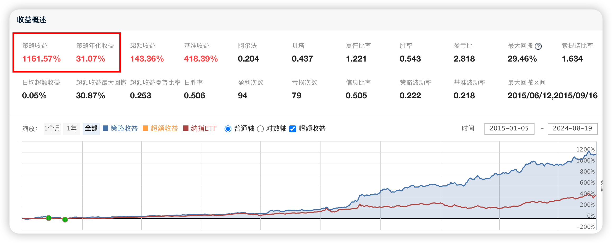

# 101、基于动量与反转因子的ETF交易策略

# 概述

本文描述了一个用于ETF（交易所交易基金）的量化交易策略的代码结构与功能。该策略结合了动量因子和反转因子的评分机制，并通过每日自动化交易来优化投资组合。代码还包含了止损机制和RSRS择时模型，以提高策略的稳健性和盈利能力。**完整代码下载地址请见文末，腾讯会议直播地址在文末获取。**



# 代码结构与功能详解

## 1. 导入必要的库

```python
import numpy as np
import pandas as pd
import math
```

  * **功能** ：引入Python中常用的科学计算库numpy、数据分析库pandas，以及数学库math，用于后续的数值计算、数据处理和分析。

## 2. 初始化函数 initialize(context)

```python
# 初始化函数
def initialize(context):
    # 设定基准
    set_benchmark('513100.XSHG')
    # 用真实价格交易
    set_option('use_real_price', True)
    # 打开防未来函数
    set_option("avoid_future_data", True)
    # 设置滑点
    set_slippage(FixedSlippage(0.002))
    # 设置交易成本
    set_order_cost(OrderCost(open_tax=0, close_tax=0, open_commission=0.0002, close_commission=0.0002, close_today_commission=0, min_commission=5), type='fund')
    # 过滤一定级别的日志
    log.set_level('system', 'error')
    # 参数
    g.etf_pool = [
        '518880.XSHG',  # 黄金ETF（大宗商品）
        '513100.XSHG',  # 纳指100（海外资产）
        '159915.XSHE',  # 创业板100（成长股，科技股，中小盘）
        '510180.XSHG',  # 上证180（价值股，蓝筹股，中大盘）
    ]
    g.m_days = 25  # 动量参考天数
    g.stop_loss_pct = 0.05  # 止损比例，5%
    run_daily(trade, '9:30')  # 每天运行确保即时捕捉动量变化
```

  * **设定基准** ：使用set_benchmark('513100.XSHG')将纳指100ETF设为策略的基准标的。

  * **真实价格交易** ：通过set_option('use_real_price', True)启用基于真实市场价格的交易。

  * **防未来函数** ：启用set_option("avoid_future_data", True)以防止未来数据泄露。

  * **设置滑点** ：通过set_slippage(FixedSlippage(0.002))设置交易时的固定滑点为0.2%。

  * **设置交易成本** ：使用set_order_cost配置交易中的税费和佣金成本，以更准确地模拟真实交易情况。

  * **日志设置** ：通过log.set_level('system', 'error')将系统日志级别设置为错误，以减少不必要的日志输出。

  * **初始化参数** ：定义ETF池g.etf_pool、动量参考天数g.m_days和止损比例g.stop_loss_pct。

  * **每日交易** ：使用run_daily(trade, '9:30')设置在每日开盘后9:30自动执行trade函数。

## 3. 获取ETF的动量评分 get_momentum_score(etf, lookback_days)

```python
# 获取ETF的动量评分
def get_momentum_score(etf, lookback_days):
    df = attribute_history(etf, lookback_days, '1d', ['close'])
    log_returns = np.log(df['close'])
    days = np.arange(log_returns.size)
    # 线性回归计算年化收益率和R方
    slope, intercept = np.polyfit(days, log_returns, 1)
    annualized_returns = np.exp(slope * 250) - 1
    r_squared = 1 - (np.sum((log_returns - (slope * days + intercept))**2) / ((len(log_returns) - 1) * np.var(log_returns, ddof=1)))
    return annualized_returns * r_squared
```

  * **功能** ：计算ETF在指定回溯天数内的动量评分，通过对数收益率的线性回归计算年化收益率，并结合R平方值衡量回归的拟合优度。

  * **返回值** ：返回动量评分，衡量该ETF在过去一段时间内的涨跌趋势。

## 4. 获取反转因子评分 get_reversal_score(etf, lookback_days)

```python
# 获取反转因子评分
def get_reversal_score(etf, lookback_days):
    df = attribute_history(etf, lookback_days, '1d', ['close'])
    log_returns = np.log(df['close'])
    days = np.arange(log_returns.size)
    # 线性回归计算年化收益率和R方
    slope, intercept = np.polyfit(days, log_returns, 1)
    annualized_returns = np.exp(slope * 250) - 1
    r_squared = 1 - (np.sum((log_returns - (slope * days + intercept))**2) / ((len(log_returns) - 1) * np.var(log_returns, ddof=1)))
    return annualized_returns * r_squared
```

  * **功能** ：计算ETF在指定回溯天数内的反转因子评分，方法与动量评分类似，但用以评估价格反转的可能性。

  * **返回值** ：返回反转评分，用于识别价格反转信号。

## 5. 获取ETF评分 get_etf_scores(etf_pool, lookback_days, reversal_lookback_days)

```python
# 获取ETF评分
def get_etf_scores(etf_pool, lookback_days, reversal_lookback_days):
    scores = []
    for etf in etf_pool:
        momentum_score = get_momentum_score(etf, lookback_days)
        reversal_score = get_reversal_score(etf, reversal_lookback_days)
        final_score = momentum_score - reversal_score / 6
        scores.append(final_score)
    return pd.DataFrame({'etf': etf_pool, 'score': scores}).sort_values(by='score', ascending=False)
```

  * **功能** ：对ETF池中的每只ETF分别计算动量评分和反转评分，综合评分后进行排序，选出表现最好的ETF。

  * **返回值** ：返回包含ETF及其综合评分的DataFrame，并按评分从高到低排序。

## 6. 交易函数 trade(context)

```python
# 交易函数
def trade(context):
    target_num = 1
    rank_df = get_etf_scores(g.etf_pool, g.m_days, g.m_days * 8)
    # 检查评分差距
    score_diff = rank_df['score'].max() - rank_df['score'].min()
    target_list = rank_df['etf'].iloc[:target_num].tolist() if 0.1 < score_diff < 15 else []
    # RSRS择时
    target_list = [etf for etf in target_list if is_above_beta(context, etf)]
    # 卖出不在目标列表中的ETF
    for etf in context.portfolio.positions:
        if etf not in target_list:
            order_target_value(etf, 0)
        else:
            # 检查是否需要止损
            if check_stop_loss(context, etf):
                order_target_value(etf, 0)
    # 买入新的ETF
    if target_list:
        cash_per_etf = context.portfolio.available_cash / len(target_list)
        for etf in target_list:
            if context.portfolio.positions[etf].total_amount == 0:
                order_target_value(etf, cash_per_etf)
```

  * **功能** ：根据每日计算的ETF评分进行交易决策，筛选出目标ETF并进行买卖操作。

  * **目标ETF筛选** ：根据评分差距筛选目标ETF，并结合RSRS择时模型进一步筛选。

  * **卖出操作** ：卖出不在目标列表中的ETF，并检查是否需要对持仓的ETF执行止损操作。

  * **买入操作** ：按资金分配比例买入符合条件的新ETF。

## 7. 判断ETF的RSRS斜率是否高于历史Beta is_above_beta(context, etf)

```python
# 判断ETF的RSRS斜率是否高于历史Beta
def is_above_beta(context, etf):
    hl = attribute_history(etf, 18, '1d', ['high', 'low'])
    slope = np.polyfit(hl['low'], hl['high'], 1)[0]
    beta = calculate_beta(context, etf)
    return slope > beta
```

  * **功能** ：通过计算ETF的RSRS斜率与历史Beta值的比较，判断是否存在强劲的市场趋势。

  * **返回值** ：如果RSRS斜率高于历史Beta值，则返回True，表示市场趋势有利。

## 8. 计算ETF的Beta值 calculate_beta(context, etf)

```python
# 计算ETF的Beta
def calculate_beta(context, etf):
    etf_data = attribute_history(etf, 250, '1d', ['high', 'low'])
    betas = [np.polyfit(etf_data['low'].iloc[i:i+20], etf_data['high'].iloc[i:i+20], 1)[0] for i in range(len(etf_data) - 21)]
    return np.mean(betas) - 2 * np.std(betas)
```

  * **功能** ：计算ETF的历史Beta值，评估该ETF相对于市场整体的波动性。

  * **返回值** ：返回计算得到的Beta值，作为RSRS择时模型的参考。

## 9. 检查是否需要止损 check_stop_loss(context, etf)

```python
# 检查是否需要止损
def check_stop_loss(context, etf):
    position = context.portfolio.positions[etf]
    current_price = attribute_history(etf, 1, '1d', ['close'])['close'][-1]
    stop_price = position.avg_cost * (1 - g.stop_loss_pct)
    return current_price < stop_price
```

  * **功能** ：判断当前价格是否触及止损点，如果触及则需要卖出该ETF以避免更大的损失。

  * **返回值** ：如果当前价格低于止损价格，返回True，表示需要执行止损操作。

# 总结

该代码实现了一个结合动量和反转因子的ETF量化交易策略。通过每日自动化评估与交易，该策略在捕捉市场趋势的同时，也考虑了市场反转的可能性，并加入了风险管理机制（如止损与择时）。这一策略结构紧凑且逻辑清晰，有助于投资者在波动的市场中做出更为理性的投资决策。

##

免责声明

本文所发布的所有内容仅供参考和技术研究，所提供的投资策略、分析和观点并不构成任何形式的投资建议。投资涉及风险，读者应根据自身的投资目标、风险承受能力及财务状况，独立做出决策。我们不对任何因文章内容而产生的投资损失或其他风险后果负责。请在投资前咨询专业的财务顾问或投资专家。
