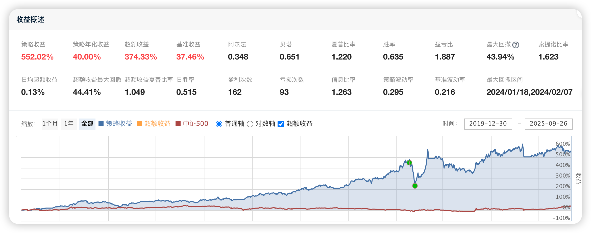
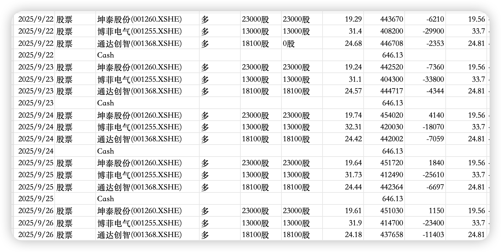

# 112、涨停捕手：强势股捕捉与动态调仓策略（源码分析与下载）

**本策略基于多因子选股方法结合资金再平衡机制，重点通过技术因子（如ARBR因子）对股票进行筛选，结合市场行情进行动态调仓。** 每周根据因子的选股结果调整持仓，确保投资组合的结构始终符合策略预设的投资逻辑。此外，策略也会根据持仓中的涨停股表现进行动态管理，及时卖出涨停打开的股票，同时防止因资金再平衡错失交易机会。**本文策略的完整代码下载地址请见文末最下方。**



主要策略模块功能：

  1. 初始化设置：定义策略的基准、交易设置、因子及其筛选范围。

  2. 股票池准备：每天清理持仓，判断是否需要资金再平衡，记录昨日涨停股票。

  3. 因子选股模块：基于因子进行股票筛选，过滤不符合条件的股票，结合市值排序进行最终筛选。

  4. 每周持仓调整：根据选股结果调整当前持仓，并对不在目标股票池的股票进行卖出。

  5. 涨停股票处理：对持仓中的涨停股进行尾盘检查，如果涨停打开则卖出。

**1\. 初始化函数：设定交易环境和策略参数**

```python
def initialize(context):
    # 设置基准指数为中证500
    set_benchmark('000905.XSHG')
    # 使用真实价格进行交易
    set_option('use_real_price', True)
    # 启用防未来数据功能
    set_option("avoid_future_data", True)
    # 设置滑点为0，表示没有滑点
    set_slippage(FixedSlippage(0))
    # 设置交易成本：开盘时无税，闭盘时每笔交易万分之三，最小佣金5元
    set_order_cost(OrderCost(open_tax=0, close_tax=0.001, open_commission=0.0003, close_commission=0.0003, close_today_commission=0, min_commission=5), type='stock')
    # 设置日志过滤级别，过滤低于error级别的日志
    log.set_level('order', 'error')
    log.set_level('system', 'error')
    # 初始化全局变量
    g.no_trading_today_signal = False  # 是否为停止交易信号
    g.stock_num = 3  # 每次持仓的股票数量
    g.hold_list = []  # 当前持仓的股票列表
    g.yesterday_HL_list = []  # 昨日涨停股票列表
    # 设置因子列表和选择的因子
    g.factor_list = [{'ARBR': (-0.9996444781983547, 0.9986148448690932)}]
    g.chosen_factor = ['ARBR']  # 选定使用的因子
    g.month_day = 1  # 每月的交易日
    # 设置策略运行时间
    run_daily(prepare_stock_list, '9:05')  # 每天9:05准备股票池
    run_weekly(weekly_adjustment, g.month_day, '9:30')  # 每周调整持仓，设定为每月第1个交易日
    run_daily(check_limit_up, '14:00')  # 每天14:00检查持仓中是否有涨停股需要卖出
    run_daily(close_account, '14:30')  # 每天14:30进行资金清算
```

功能说明：

  * 初始化策略的基准、交易设置（如滑点、交易成本、日志设置等）。

  * 设置因子列表与筛选范围，为后续的选股模块做准备。

  * 每天及每周定时运行不同的函数以管理股票池及持仓。

**2\. 股票池准备函数：获取持仓和涨停股数据**

```python
def prepare_stock_list(context):
    # 清空当前持仓股票列表
    g.hold_list = []
    # 获取当前持仓的股票
    for position in list(context.portfolio.positions.values()):
        stock = position.security
        g.hold_list.append(stock)
    # 获取昨日涨停的股票
    if g.hold_list != []:
        df = get_price(g.hold_list, end_date=context.previous_date, frequency='daily', fields=['close','high_limit'], count=1, panel=False, fill_paused=False)
        df = df[df['close'] == df['high_limit']]  # 筛选出收盘价等于涨停价的股票
        g.yesterday_HL_list = list(df.code)  # 更新昨日涨停股票列表
    else:
        g.yesterday_HL_list = []
    # 判断是否为账户资金再平衡的日期
    g.no_trading_today_signal = today_is_between(context, '04-05', '04-30')
```

功能说明：

  * 清空并更新持仓股票列表。

  * 检查昨日涨停的股票并记录。

  * 判断当前是否需要进行资金再平衡的操作。

**3\. 选股模块：基于因子筛选股票**

```python
def get_stock_list(context):
    # 获取昨日和今天的日期
    yesterday = context.previous_date
    today = context.current_dt
    # 获取所有股票的列表
    initial_list = get_all_securities('stock', today).index.tolist()
    # 过滤不符合条件的股票
    initial_list = filter_all_stock2(context, initial_list)
    final_list = []
    # 获取因子列表
    factor_list = list(g.factor_list[0].keys())
    # 获取因子数据
    factor_data = get_factor_values(initial_list, factor_list, end_date=yesterday, count=1)
    df_jq_factor_value = pd.DataFrame(index=initial_list, columns=factor_list)
    for factor in factor_list:
        df_jq_factor_value[factor] = list(factor_data[factor].T.iloc[:, 0])
    # 对因子数据进行标准化处理
    df_jq_factor_value = data_preprocessing(df_jq_factor_value, initial_list, industry_code, yesterday)
    df = df_jq_factor_value
    df = df.dropna()  # 去除缺失值
    # 根据选择的因子筛选股票
    for factor in g.chosen_factor:
        df = df[(df[factor] >= g.factor_list[0][factor][0]) & (df[factor] <= g.factor_list[0][factor][1])]
        print(f'过滤完 {factor} ，剩余：{len(df)}')
    postive_list = list(df.index)  # 选定的股票列表
    log.info(f'因子筛选后的数量：{len(postive_list)}/{len(df)}')
    # 根据市值进行排序，选择市值较小的股票
    q = query(valuation.code, valuation.circulating_market_cap, indicator.eps).filter(valuation.code.in_(postive_list)).order_by(valuation.circulating_market_cap.asc())
    df2 = get_fundamentals(q)
    df2 = df2[df2['eps'] > 0]
    lst = list(df2.code)
    # 选择前N只股票
    lst = lst[:min(g.stock_num, len(lst))]
    # 添加到最终选股列表
    for stock in lst:
        if stock not in final_list:
            final_list.append(stock)
    return final_list
```

功能说明：

  * 基于多个因子（如ARBR）筛选股票，并进行数据预处理。

  * 对股票进行因子筛选，并根据市值和盈利情况选择最具吸引力的股票。

**4\. 每周调整持仓：调仓并卖出不在目标池中的股票**

```python
def weekly_adjustment(context):
    if not g.no_trading_today_signal:  # 判断是否为停止交易的日期
        # 获取应买入的股票列表
        target_list = get_stock_list(context)
        # 卖出不在目标列表中的股票
        for stock in g.hold_list:
            if stock not in target_list and stock not in g.yesterday_HL_list:
                log.info("卖出[%s]" % (stock))
                position = context.portfolio.positions[stock]
                close_position(position)
            else:
                log.info("已持有[%s]" % (stock))
        # 调仓买入新股票
        position_count = len(context.portfolio.positions)
        target_num = len(target_list)
        if target_num > position_count:
            value = context.portfolio.cash / (target_num - position_count)
            for stock in target_list:
                if context.portfolio.positions[stock].total_amount == 0:
                    if open_position(stock, value):
                        if len(context.portfolio.positions) == target_num:
                            break
```

功能说明：

  * 每周调整持仓，卖出不符合目标的股票，并买入新的优选股票。

**5\. 涨停股票处理：检查并管理涨停股票**

```python
def check_limit_up(context):
    now_time = context.current_dt
    if g.yesterday_HL_list:
        for stock in g.yesterday_HL_list:
            current_data = get_price(stock, end_date=now_time, frequency='1m', fields=['close', 'high_limit'], skip_paused=False, fq='pre', count=1, panel=False, fill_paused=True)
            if current_data.iloc[0, 0] < current_data.iloc[0, 1]:
                log.info("[%s]涨停打开，卖出" % (stock))
                position = context.portfolio.positions[stock]
                close_position(position)
            else:
                log.info("[%s]涨停，继续持有" % (stock))
```

功能说明：

  * 每天尾盘检查涨停股票的表现，若涨停打开，则及时卖出。



**通过网盘分享的文件：112、涨停捕手：强势股捕捉与动态调仓策略（源码分析与下载）.txt.zip**

**链接: https://pan.baidu.com/s/1ddd7kBLD79ScWu7wUnoPwQ 提取码: fwm5**

免责声明

本文所发布的所有内容仅供参考和技术研究，所提供的投资策略、分析和观点并不构成任何形式的投资建议。投资涉及风险，读者应根据自身的投资目标、风险承受能力及财务状况，独立做出决策。我们不对任何因文章内容而产生的投资损失或其他风险后果负责。请在投资前咨询专业的财务顾问或投资专家。
