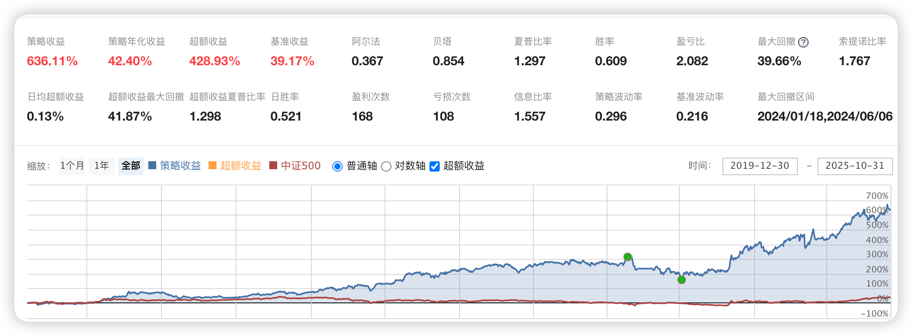

# 113、多因子模型量化选股与动态调整策略

本策略通过多因子筛选和动态调整，结合技术指标与市场数据，进行高效的股票选取与持仓调整。策略的核心目标是选择具备成长潜力的优质股票，并通过不断优化持仓，提高投资组合的收益。本文策略的完整代码下载地址请见文末最下方。



本策略实现了以下功能：

  1. 选股模块：利用多种因子（如营业收入增长、盈利增长、PEG比率等）筛选优质股票。

  2. 持仓调整模块：每周和每天根据市场数据进行持仓优化，卖出不符合预期的股票，并将资金投入到新的优质股票中。

  3. 风控模块：通过设置规则避免持仓过多、避免跌幅过大、避免涨停股等风险。

  4. 交易模块：包括开仓和平仓的自定义函数，以确保交易执行的灵活性和精准性。

## 策略代码各部分功能详细介绍：


### **1\. 初始化函数**

```python
def initialize(context):
    # 设定基准
    set_benchmark('000905.XSHG')  # 设置上证180指数作为基准
    set_option('use_real_price', True)  # 使用真实价格进行交易
    set_option("avoid_future_data", True)  # 避免使用未来数据
    log.set_level('order', 'error')  # 设置日志等级为error，避免日志干扰
    set_order_cost(OrderCost(close_tax=0.001, open_commission=0.0003, close_commission=0.0003, min_commission=5), type='stock')  # 设置交易手续费
    # 初始化全局变量
    g.stock_num = 5  # 持股数量
    g.limit_days = 20  # 检查过去20天内是否涨停
    g.hold_list = []  # 持仓列表
    g.history_hold_list = []  # 历史持仓列表
    g.not_buy_again_list = []  # 最近买过的股票列表
    g.switch = 0  # 开关变量
    # 设置交易时间，每天执行
    run_daily(prepare_stock_list, time='9:05', reference_security='000300.XSHG')
    # 每周执行：获取并调整持仓股票
    run_weekly(weekly_adjustment, weekday=1, time='9:30', reference_security='000300.XSHG')
    # 每日执行：检查涨停股票
    run_daily(check_limit_up, time='14:00', reference_security='000300.XSHG')
    # 每日执行：检查长上影线股票
    run_daily(check_csy, time='09:30', reference_security='000300.XSHG')
```

功能说明：该函数初始化策略参数、设置基准指数、交易手续费、日志等级等。并且设置了每日、每周的运行任务，包括准备股票池、持仓调整、涨停股处理等。


### **2\. 选股模块**

**2.1 根据因子筛选股票**

```python
def get_single_factor_list(context, stock_list, jqfactor, sort, p1, p2):
    yesterday = context.previous_date
    s_score = get_factor_values(stock_list, jqfactor, end_date=yesterday, count=1)[jqfactor].iloc[0].dropna().sort_values(ascending=sort)
    return s_score.index[int(p1 * len(stock_list)):int(p2 * len(stock_list))].tolist()
```

功能说明：该函数通过调用get_factor_values获取因子值，并根据给定的排序方式（升序/降序）筛选股票，返回前p2比例的股票。

**2.2 根据市值排序**

```python
def sorted_by_circulating_market_cap(stock_list, n_limit_top=5):
    q = query(valuation.code).filter(valuation.code.in_(stock_list), indicator.eps > 0).order_by(valuation.circulating_market_cap.asc()).limit(n_limit_top)
    return get_fundamentals(q)['code'].tolist()
```

功能说明：该函数根据市值对股票进行排序，并返回前n_limit_top个市值最小的股票。

**2.3 筛选股票列表**

```python
def get_stock_list(context):
    by_date = context.previous_date - datetime.timedelta(days=375)
    initial_list = get_all_securities(date=by_date).index.tolist()
    initial_list = filter_kcb_stock(initial_list)
    initial_list = filter_st_stock(initial_list)
    # 使用多种因子进行选股
    sg_list = get_single_factor_list(context, initial_list, 'sales_growth', False, 0, 0.1)
    sg_list = sorted_by_circulating_market_cap(sg_list)
    # 更多因子选股
    # ...
    # 返回并集的前12只股票
    union_list = list(set(sg_list).union(set(ms_list)).union(set(peg_list)))
    union_list = sorted_by_circulating_market_cap(union_list, 12)
    print('选股结果：', union_list)
    return union_list
```

功能说明：该函数通过多个因子（如销售增长、盈利增长、PEG等）筛选股票，并结合市值进行排序，最后返回前12只股票。


### **3\. 持仓管理模块**

**3.1 准备股票池**

```python
def prepare_stock_list(context):
    # 获取已持仓列表
    g.hold_list = list(context.portfolio.positions)
    # 获取历史持仓列表
    g.history_hold_list.append(g.hold_list)
    if len(g.history_hold_list) >= g.limit_days:
        g.history_hold_list = g.history_hold_list[-g.limit_days:]
    temp_set = set()
    for hold_list in g.history_hold_list:
        temp_set = temp_set.union(set(hold_list))
    g.not_buy_again_list = list(temp_set)
```

功能说明：该函数获取已持仓股票、历史持仓列表，并生成不再购买的股票列表（即最近20天内买过的股票）。

**3.2 每周调整持仓**

```python
def weekly_adjustment(context):
    # 获取目标股票列表
    target_list = get_stock_list(context)
    target_list = filter_paused_stock(target_list)
    target_list = filter_limit_stock(context, target_list)
    # 去除不符合条件的股票
    recent_limit_up_list = get_recent_limit_up_stock(context, target_list, g.limit_days)
    black_list = list(set(g.not_buy_again_list).intersection(set(recent_limit_up_list)))
    target_list = [stock for stock in target_list if stock not in black_list]
    if len(target_list) > 10:
        target_list = target_list[:10]
    # MA20斜率计算
    # ...
    # 调整持仓
    for stock in g.hold_list:
        if (stock not in target_list) and (stock not in g.high_limit_list):
            log.info("卖出[%s]" % stock)
            position = context.portfolio.positions[stock]
            close_position(position)
        else:
            log.info("已持有[%s]" % stock)
    position_count = len(context.portfolio.positions)
    target_num = g.stock_num
    if target_num > position_count:
        value = context.portfolio.available_cash / (target_num - position_count)
        for stock in target_list:
            if stock not in context.portfolio.positions:
                if open_position(stock, value):
                    if len(context.portfolio.positions) >= g.stock_num:
                        break
```

功能说明：该函数每周执行持仓调整，剔除不符合条件的股票，并调整持仓比例。


### 4. 风控与交易模块

**4.1 卖出涨停股票**

```python
def check_limit_up(context):
    current_data = get_current_data()
    if g.high_limit_list:
        for stock in g.high_limit_list:
            if current_data[stock].last_price < current_data[stock].high_limit:
                log.info("[%s]涨停打开，卖出" % stock)
                position = context.portfolio.positions[stock]
                close_position(position)
```

功能说明：该函数检查持仓中的涨停股票，如果其价格突破涨停价，则卖出。

**4.2 卖出大阴线股票**

```python
def check_csy(context):
    if g.switch == 0:
        g.switch = g.switch + 1
    else:
        yesterday = context.previous_date
        dict_high = history(1, unit='1d', field='high', security_list=g.hold_list, df=False, skip_paused=False, fq='pre')
        dict_open = history(1, unit='1d', field='open', security_list=g.hold_list, df=False, skip_paused=False, fq='pre')
        dict_close = history(2, unit='1d', field='close', security_list=g.hold_list, df=False, skip_paused=False, fq='pre')
        for stock in g.hold_list:
            kpzf = (dict_open[stock][0] - dict_close[stock][0]) / dict_close[stock][0]
            spzf = (dict_close[stock][1] - dict_close[stock][0]) / dict_close[stock][0]
            if (kpzf - spzf) > 0.068:
                log.info("[%s]昨日大阴线，卖出" % stock)
                position = context.portfolio.positions[stock]
                close_position(position)
```

功能说明：该函数检查是否持仓股票出现大阴线，如果大阴线超过7%，则卖出。

4.3 自定义交易函数

```python
def order_target_value_(security, value):
    if value == 0:
        log.debug("Selling out %s" % security)
    else:
        log.debug("Order %s to value %f" % (security, value))
    return order_target_value(security, value)
```

功能说明：该函数是订单处理函数，用于发送买卖订单。


### 总结

该量化策略基于多因子模型进行选股，并结合技术指标（如涨停、跌幅等）进行动态调整。每周和每日根据市场变化对持仓进行优化，以保证组合的收益最大化。策略还结合了风控模块，避免了不符合条件的股票持仓。

**通过网盘分享的文件：多因子模型量化选股与动态调整策略.txt**

**代码下载链接:**<https://pan.baidu.com/s/1o3c7iPHIfCG5H4vojTMLPg>

**提取码:** avbd
