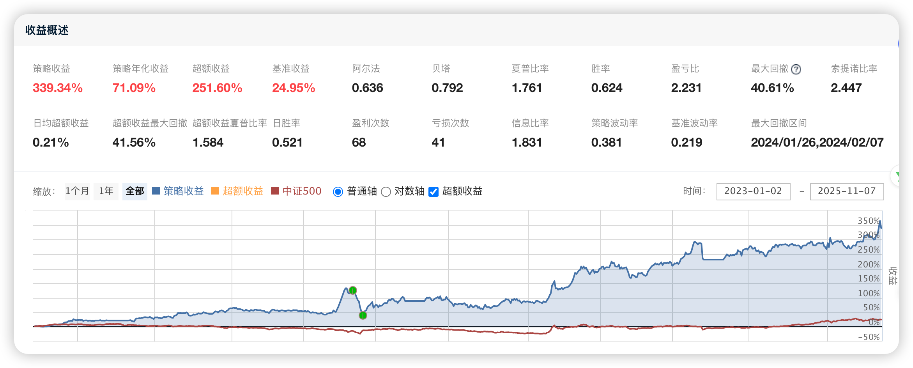

# 114、多因子选股与动态调仓策略

本策略结合了多因子选股、动态调仓、资金管理及风控机制，旨在通过分析多个财务和技术因子来筛选具有投资潜力的股票，并且每周进行适时的调仓，确保组合的风险和收益最优化。具体的策略操作包括：

1) 基于多因子模型（情绪类、质量类、动量类等因子）筛选股票；

2) 每周根据最新的因子评分和基本面数据调整仓位；

3) 定期检查和处理持仓中的涨停股、跌停股、停牌股等特殊股票；

4) 每日对投资组合进行风险控制与资金管理，确保符合资金再平衡和退出机制。

**本文策略的完整代码下载地址请见文末最下方。**



## 各部分功能代码及说明：

### 1. 初始化函数（initialize）

```python
def initialize(context):
    # 设置基准指数，所有绩效以该指数为参考基准
    set_benchmark('000905.XSHG')
    # 使用真实价格进行交易
    set_option('use_real_price', True)
    # 打开防未来函数，避免使用未来数据
    set_option("avoid_future_data", True)
    # 设置滑点为0，即不考虑交易中的滑点影响
    set_slippage(FixedSlippage(0))
    # 设置交易费用，包含买卖佣金与税费
    set_order_cost(OrderCost(open_tax=0, close_tax=0.001, open_commission=0.0003, close_commission=0.0003, close_today_commission=0, min_commission=5), type='stock')
    # 设置日志级别，防止输出不必要的日志信息
    log.set_level('order', 'error')
    # 初始化全局变量
    g.no_trading_today_signal = False
    g.stock_num = 1  # 每次调仓买入的股票数量
    g.hold_list = []  # 当前持仓的股票列表
    g.yesterday_HL_list = []  # 记录昨日涨停的股票列表
    # 定义多因子模型和权重
    g.factor_list = [
        (['ARBR', 'SGAI', 'net_profit_to_total_operate_revenue_ttm', 'retained_profit_per_share'], [-0.00015, 0.0068, -0.0135, -0.0504]),
        (['Price1Y', 'total_profit_to_cost_ratio', 'VOL120'], [-1.6482, -0.1706, -0.0618]),
        (['debt_to_assets', 'operating_cost_to_operating_revenue_ratio', 'DAVOL20', 'price_no_fq', 'sales_growth'], [0.0582, -0.191, -0.2737, -0.0275, 0.1189])
    ]
    # 设置交易运行时间
    run_daily(prepare_stock_list, '9:05')
    run_weekly(weekly_adjustment, 1, '9:30')
    run_daily(check_limit_up, '14:00')
    run_daily(close_account, '14:30')
    run_daily(print_position_info, '15:10')
```

说明：初始化函数主要设定了策略的一些基础配置，包括基准指数、滑点、交易费用、日志级别等。并且初始化了股票池和因子列表，因子列表包括了情绪类、质量类和动量类等不同类型的因子，每个因子组内的因子按特定的权重进行加权计算。

### 2. 准备股票池（prepare_stock_list）

```python
def prepare_stock_list(context):
    # 获取已持有的股票列表
    g.hold_list = [position.security for position in list(context.portfolio.positions.values())]
    # 获取昨日涨停股票列表
    if g.hold_list:
        df = get_price(g.hold_list, end_date=context.previous_date, frequency='daily', fields=['close', 'high_limit'], count=1, panel=False, fill_paused=False)
        df = df[df['close'] == df['high_limit']]
        g.yesterday_HL_list = list(df.code)
    else:
        g.yesterday_HL_list = []
    # 判断今天是否为账户资金再平衡的日期
    g.no_trading_today_signal = today_is_between(context, '04-05', '04-30')
```

说明：该函数用于获取当前持仓的股票列表，并检查昨日涨停的股票。此外，它还判断是否为资金再平衡的日期，决定是否进行当天的资金调整操作。

### 3. 选股模块（get_stock_list）

```python
def get_stock_list(context):
    yesterday = context.previous_date
    today = context.current_dt
    # 获取所有证券列表
    initial_list = get_all_securities('stock', today).index.tolist()
    initial_list = filter_new_stock(context, initial_list)
    initial_list = filter_kcbj_stock(initial_list)
    initial_list = filter_st_stock(initial_list)
    final_list = []
    # 通过多因子模型选股
    for factor_list, coef_list in g.factor_list:
        factor_values = get_factor_values(initial_list, factor_list, end_date=yesterday, count=1)
        df = pd.DataFrame(index=initial_list, columns=factor_values.keys())
        for i in range(len(factor_list)):
            df[factor_list[i]] = list(factor_values[factor_list[i]].T.iloc[:, 0])
        df = df.dropna()
        df['total_score'] = sum(coef * df[factor] for coef, factor in zip(coef_list, factor_list))
        df = df.sort_values(by=['total_score'], ascending=False)
        # 筛选得分较高的股票
        df_pos = df[df['total_score'] > 0]
        complex_factor_list = list(df_pos.index)[:int(0.1 * len(df))]
        q = query(valuation.code, valuation.circulating_market_cap, indicator.eps).filter(valuation.code.in_(complex_factor_list)).order_by(valuation.circulating_market_cap.asc())
        df = get_fundamentals(q)
        df = df[df['eps'] > 0]
        lst = list(df.code)
        lst = filter_paused_stock(lst)
        lst = filter_limitup_stock(context, lst)
        lst = filter_limitdown_stock(context, lst)
        lst = lst[:min(g.stock_num, len(lst))]
        for stock in lst:
            if stock not in final_list:
                final_list.append(stock)
    return final_list
```

说明：该函数根据多因子模型选股，包括情绪类、质量类和动量类等因子，计算每只股票的综合得分，并选出得分较高的股票作为候选池。选股的过程还包括基本面筛选，如过滤掉停牌股、涨停股、跌停股等不符合交易要求的股票。

### 4. 周度调整持仓（weekly_adjustment）

```python
def weekly_adjustment(context):
    if not g.no_trading_today_signal:
        target_list = get_stock_list(context)
        # 卖出不符合的股票
        for stock in g.hold_list:
            if stock not in target_list and stock not in g.yesterday_HL_list:
                log.info(f"卖出[{stock}]")
                position = context.portfolio.positions[stock]
                close_position(position)
            else:
                log.info(f"已持有[{stock}]")
        # 买入新的股票
        position_count = len(context.portfolio.positions)
        target_num = len(target_list)
        if target_num > position_count:
            value = context.portfolio.cash / (target_num - position_count)
            for stock in target_list:
                if context.portfolio.positions[stock].total_amount == 0:
                    if open_position(stock, value):
                        if len(context.portfolio.positions) == target_num:
                            break
```

说明：每周根据选股结果调整持仓。卖出不符合的新股票并买入新的目标股票。此操作在每周指定的时间执行，确保策略及时调整以适应市场变化。

### 5. 涨停股检查（check_limit_up）

```python
def check_limit_up(context):
    now_time = context.current_dt
    if g.yesterday_HL_list:
        for stock in g.yesterday_HL_list:
            current_data = get_price(stock, end_date=now_time, frequency='1m', fields=['close', 'high_limit'], skip_paused=False, fq='pre', count=1, panel=False, fill_paused=True)
            if current_data.iloc[0, 0] < current_data.iloc[0, 1]:
                log.info(f"[{stock}]涨停打开，卖出")
                position = context.portfolio.positions[stock]
                close_position(position)
            else:
                log.info(f"[{stock}]涨停，继续持有")
```

说明：每日检查持仓中的涨停股。如果涨停股在当日开盘后未能维持涨停，则卖出该股票；否则继续持有。

### 6. 其他辅助功能模块：

  * 过滤停牌股票、过滤ST股票、过滤次新股等模块的作用是确保选股时过滤掉不符合投资标准的股票，如停牌、ST、退市股票等。


通过上述策略配置与代码模块，整体的目标是通过多因子选股与动态调整持仓的方式，优化投资组合的收益与风险控制。

**通过网盘分享的文件：114、多因子选股与动态调仓策略.zip**

**下载链接:** <https://pan.baidu.com/s/1Dr3q3ov90J7Xm5QIO3dJKA>

**提取码: dbds**
