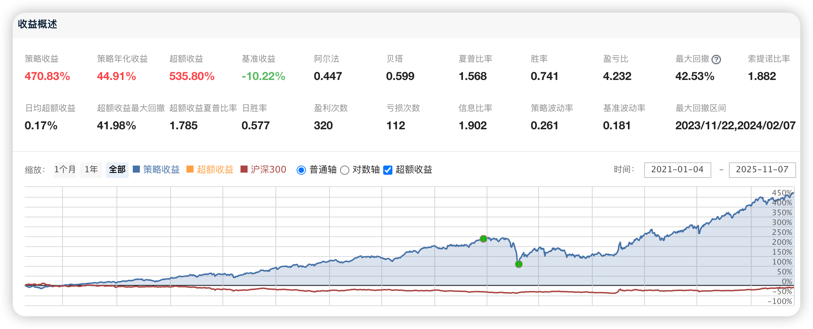

# 115、低估值股息成长多因子择优策略

## 一、策略总体介绍

本策略融合了价值因子与成长因子的投资逻辑，通过量化方式筛选出同时具备高股息率与低PEG的优质股票，并在月度周期内进行等权调仓。高股息代表公司现金流稳健，低PEG代表成长性良好且估值合理。两者结合，使得投资组合兼具防御与进攻属性。**本文策略的完整代码下载地址请见文末最下方。**



策略主要包括以下环节：

  * 股票筛选：基于股息率、PEG、价格三个维度。

  * 风控机制：剔除停牌、ST、涨停股票，并设定涨停开板止盈。

  * 调仓逻辑：每月定期执行，等权分配资金。

  * 数据与交易控制：避免未来函数、控制下单比例、模拟真实费用。

该策略重点在于平衡风险与收益，追求长期稳健复利。


## 二、各模块详细说明与代码


### 1. 初始化模块 initialize(context)

说明：该模块设置策略运行环境与调度逻辑。包括日志级别、价格模式、交易限制、基准、手续费、滑点等。并定义全局变量与时间调度函数，使整个策略具备自动化运行能力。

代码：

```python
def initialize(context):
    # 设置日志输出级别
    log.set_level('order', 'error')
    set_option('use_real_price', True)
    set_option('avoid_future_data', True)
    # 下单不超过成交量的10%
    set_option('order_volume_ratio', 0.1)
    # 设置回测基准
    set_benchmark('000300.XSHG')
    # 设置交易成本
    set_order_cost(OrderCost(open_tax=0, close_tax=0.001,
                             open_commission=0.0003, close_commission=0.0003,
                             min_commission=5), type='stock')
    # 设置滑点
    set_slippage(FixedSlippage(0.002))
    # 全局变量定义
    g.stock_num = 20
    g.buylist = []
    g.high_limit_list = []
    # 调度计划
    run_daily(get_high_limit, time='9:00')
    run_monthly(get_stocks, 1, time='10:00')
    run_monthly(trade_stocks, 1, time='14:55')
    run_monthly(show_cap, 1, time='16:00')
    run_daily(check_high_limit, time='14:40')
```


### 2. 股票池构建模块 get_stocks(context)

说明：核心选股模块，按多重因子筛选目标股票。执行步骤：

  1. 排除上市不足180天的新股。

  2. 过滤ST、停牌、涨停等异常股票。

  3. 按股息率选出前25%高股息股票。

  4. 再按PEG筛选出成长性较好的股票。

  5. 过滤高价股，保留中低价股票。

  6. 最终取前20只作为目标买入列表。

代码：

```python
def get_stocks(context):
    # 剔除上市不足180天的新股
    all_stocks = list(get_all_securities(['stock']).index)
    stock_list = [s for s in all_stocks
                  if (context.current_dt.date() - get_security_info(s).start_date).days > 180]
    # 过滤ST、退市、停牌、涨跌停股票
    stock_list = filter_all_stocks(context, stock_list)
    # 筛选高股息率股票
    stock_list = get_dividend_ratio_filter_list(context, stock_list, limit=0.25)
    # 筛选PEG低的股票
    stock_list = get_peg(context, stock_list)
    # 过滤高价股
    stock_list = filter_highprice_stock(context, stock_list)
    # 取前20只股票
    g.buylist = stock_list[:g.stock_num]
    log.info("选股完成，共选出{}只股票".format(len(g.buylist)))
```


### 3. 调仓模块 trade_stocks(context)

说明：每月定期执行调仓，确保持仓与选股结果同步。逻辑：

  * 卖出不在目标名单中的股票。

  * 用剩余资金平均买入目标股票。

  * 每只股票等权分配仓位，防止集中风险。

代码：

```python
def trade_stocks(context):
    current_data = get_current_data()
    # 卖出不在买入名单中的股票
    for stock in context.portfolio.positions:
        if stock not in g.buylist:
            order_target_value(stock, 0)
            log.info("卖出 {}".format(stock))
    # 计算剩余资金并买入新股票
    cash = context.portfolio.cash
    target_value = cash / (g.stock_num - len(context.portfolio.positions))
    for stock in g.buylist:
        if stock not in context.portfolio.positions:
            order_value(stock, target_value)
            log.info("买入 {}".format(stock))
```


### 4. 持仓信息输出模块 show_cap(context)

说明：在每次调仓后，输出当前持仓股票的市值、股价等信息，便于回测分析或实盘监控。

代码：

```python
def show_cap(context):
    current_data = get_current_data()
    log.info("当前持仓市值：")
    for stock, position in context.portfolio.positions.items():
        log.info("{}：市值 {:.2f} 元，现价 {:.2f}".format(
            stock, position.value, current_data[stock].last_price))
```


### 5. 股息率筛选模块 get_dividend_ratio_filter_list(context, stock_list, limit=0.25)

说明：计算每只股票过去一年的股息率（分红总额 / 总市值）。取股息率排名前25%的股票作为高股息筛选结果。

代码：

```python
def get_dividend_ratio_filter_list(context, stock_list, limit=0.25):
    end_date = context.current_dt.date()
    start_date = end_date - timedelta(days=365)
    # 查询分红数据
    df = finance.run_query(
        query(finance.STK_XR_XD.code, finance.STK_XR_XD.cash_div).filter(
            finance.STK_XR_XD.code.in_(stock_list),
            finance.STK_XR_XD.announcement_date >= start_date,
            finance.STK_XR_XD.announcement_date <= end_date))
    df = df.groupby('code')['cash_div'].sum().reset_index()
    # 获取市值数据
    q = query(valuation.code, valuation.market_cap).filter(valuation.code.in_(stock_list))
    df_val = get_fundamentals(q)
    merged = pd.merge(df, df_val, on='code')
    merged['dividend_yield'] = merged['cash_div'] / merged['market_cap']
    # 按股息率排序
    merged = merged.sort_values('dividend_yield', ascending=False)
    count = int(len(merged) * limit)
    return list(merged.iloc[:count]['code'])
```


### 6. PEG筛选模块 get_peg(context, stocks)

说明：计算并筛选PEG（PE / 利润增长率）。排除极端值，选取成长性强且估值合理的股票。

代码：

```python
def get_peg(context, stocks):
    q = query(valuation.code, valuation.pe_ratio, indicator.inc_net_profit_year_on_year).filter(
        valuation.code.in_(stocks))
    df = get_fundamentals(q)
    # 计算PEG
    df['PEG'] = df['pe_ratio'] / df['inc_net_profit_year_on_year']
    df = df[(df['PEG'] > 0) & (df['PEG'] < 3)]  # 合理区间
    df = df.sort_values('PEG')
    return list(df['code'])
```


### 7. 涨停监控与止盈模块

说明：该模块用于跟踪昨日涨停的股票，若次日开板则立即卖出止盈。属于短期风控手段，避免利润回吐。

代码：

```python
def get_high_limit(context):
    g.high_limit_list = []
    current_data = get_current_data()
    for stock in context.portfolio.positions:
        price = current_data[stock].last_price
        if price >= current_data[stock].high_limit:
            g.high_limit_list.append(stock)
def check_high_limit(context):
    current_data = get_current_data()
    for stock in g.high_limit_list:
        if current_data[stock].last_price < current_data[stock].high_limit:
            order_target_value(stock, 0)
            log.info("开板卖出 {}".format(stock))
```


### 8. 股票过滤模块 filter_all_stocks(context, stock_list)

说明：过滤掉不适合投资的股票，如ST、退市、停牌、科创板、北交所及涨跌停股票。保证交易安全与流动性。

代码：

```python
def filter_all_stocks(context, stock_list):
    current_data = get_current_data()
    result = []
    for stock in stock_list:
        info = get_security_info(stock)
        if stock.startswith(('68', '4', '8')):  # 剔除科创板、北交所
            continue
        if current_data[stock].paused:  # 停牌
            continue
        if current_data[stock].is_st or 'ST' in info.display_name or '*' in info.display_name or '退' in info.display_name:
            continue
        price = current_data[stock].last_price
        if price == current_data[stock].high_limit or price == current_data[stock].low_limit:
            continue
        result.append(stock)
    return result
```


### 9. 高价股过滤模块 filter_highprice_stock(context, stock_list)

说明：计算所有股票的当前价，剔除价格处于市场高位（前25%）的股票，仅保留中低价股票。

代码：

```python
def filter_highprice_stock(context, stock_list):
    prices = history(1, '1m', 'close', stock_list).iloc[0]
    threshold = prices.quantile(0.75)
    result = prices[prices < threshold].index.tolist()
    return result
```


## 三、策略总结

该“股息成长多因子择优策略”融合了价值与成长两大核心思想。通过高股息率确保防御能力，通过低PEG挖掘成长潜力，再辅以价格过滤与风险控制，实现收益稳定与回撤控制的平衡。

策略特点如下：

  * 稳健性：高股息防御性强；

  * 成长性：PEG低代表潜在业绩增长；

  * 低频交易：月度调仓降低成本；

  * 智能风控：涨停监控与开板止盈机制；

  * 实盘友好：考虑成交量、滑点、佣金等真实条件。

从中长期角度看，该策略能在震荡市与趋势市中均保持较好的风险收益比，是一种适合资金量较大、风险偏好中性的投资者的多因子量化策略。

**通过网盘分享的文件：低估值股息成长多因子择优策略.zip**

**下载链接:** <https://pan.baidu.com/s/1yjr3elhO5ZiYnaF5-hlkVg>

**提取码** : c976
