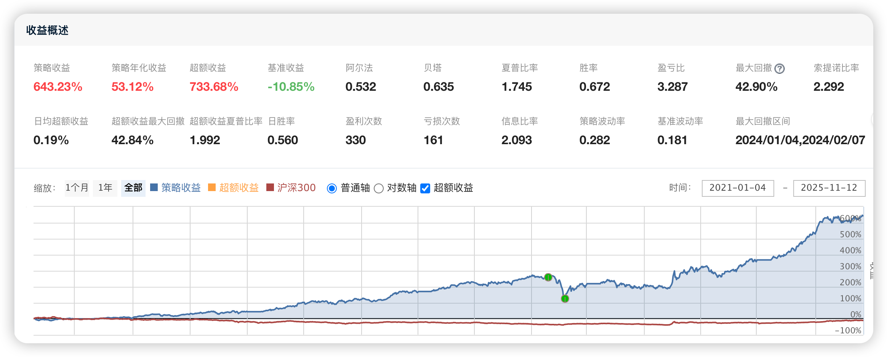

# 116、低PEG高成长精选轮动策略

本策略「**A股低PEG高成长精选轮动策略** 」是一个以**财报因子选股 + 低频轮动 + 涨停与炸板风控 + 固定仓位控制** 为核心框架的多因子股票策略：在全市场中先剔除 ST、退市、停牌、新股等高风险或不可交易股票，再利用营收同比增速、扣非净利润同比增速、PE-TTM 与 PEG 等基本面因子，精选出高成长、估值不过分昂贵的股票构建组合，每周一进行集中调仓，并通过“近期持仓与涨停黑名单”“昨日涨停股尾盘炸板检查”控制追高和回撤风险，同时在 4 月等特定时间段内强制空仓，从而实现一种偏中低频、基本面驱动、兼顾风险控制的主动选股策略。**本文策略的完整代码下载地址请见文末最下方。**



## 一、全局导入与环境设置

### 1. 代码

```python
from jqdata import *                  # JoinQuant 主库
import datetime                       # 时间与日期处理
import pandas as pd                   # 数据处理库
```

### 2. 说明

  * from jqdata import *引入聚宽的主库，包含 set_benchmark、get_price、get_fundamentals、order_target、OrderCost 等所有策略编写需要的 API。

  * import datetime用于日期计算，例如计算“去年同一天”、控制新股上市天数、判断区间时间等。

  * import pandas as pd用于处理财报数据 DataFrame，例如 merge、计算同比增速、排序、过滤等。


## 二、初始化模块 initialize

### 1. 代码

```python
def initialize(context):
    """
    初始化函数：设置回测基准、滑点、手续费、全局变量与定时任务
    """
    # 设置基准指数，这里使用沪深300
    set_benchmark('000300.XSHG')
    # 使用真实价格撮合（更接近实盘）
    set_option('use_real_price', True)
    # 避免未来函数（强制不使用未来数据）
    set_option("avoid_future_data", True)
    # 过滤掉 order 系列 API 产生的比 error 级别低的 log
    log.set_level('order', 'error')
    # 设置固定滑点，假设每笔交易有 0.02 元价差
    set_slippage(FixedSlippage(0.02))
    # 设置股票交易成本
    # 买入：佣金 0.0002
    # 卖出：佣金 0.0002 + 印花税 0.001
    # 每笔最低佣金：0.01
    set_order_cost(
        OrderCost(
            close_tax=0.001,             # 卖出印花税
            open_commission=0.0002,      # 买入佣金
            close_commission=0.0002,     # 卖出佣金
            min_commission=0.01          # 最低佣金
        ),
        type='stock'
    )
    # === 全局参数初始化 ===
    g.total_stock_num = 10             # 目标最大持仓股票数量
    g.hold_list = []                   # 当前持仓股票列表
    g.buy_list = []                    # 每次调仓时的目标买入列表
    g.high_limit_list = []             # 昨日涨停且仍持仓的股票列表
    g.limit_up_list = []               # （预留变量）记录持仓中涨停的股票
    g.history_hold_list = []           # 最近一段时间内持有过的股票记录
    g.not_buy_again_list = []          # 在某段时间内不再买入的黑名单股票
    g.limit_days = 20                  # 黑名单生效天数（近期涨停不再追高的天数）
    g.is_empty_position = False        # 是否当前需要空仓（例如：4 月全月空仓）
    # === 定时任务设定 ===
    # 每个交易日开盘前运行：准备数据、信号
    run_daily(before_market_open, time='09:25', reference_security='000300.XSHG')
    # 每周一开盘后运行：核心调仓逻辑
    run_weekly(market_opened, weekday=1, time='09:30', reference_security='000300.XSHG')
    # 每个交易日尾盘前检查涨停股（防止炸板）
    run_daily(check_limit_up, time='14:40', reference_security='000300.XSHG')
    # 每个交易日尾盘清仓（如果当日被标记为需要空仓）
    run_daily(clear_account, time='14:50')
```

### 2. 说明（拆解）

  1. **回测与撮合环境**

```python
set_benchmark('000300.XSHG')
set_option('use_real_price', True)
set_option("avoid_future_data", True)
log.set_level('order', 'error')
set_slippage(FixedSlippage(0.02))
```
     * 设定沪深 300 为基准指数，用于业绩对比。

     * 使用真实价格撮合，更贴近实盘成交。

     * 启用“避免未来数据”，防止未来函数导致回测失真。

     * 降低订单日志的噪音，只输出 error 级别。

     * 用固定滑点 0.02 元近似模拟买卖价差与冲击成本。

  2. **交易成本模型**

```python
set_order_cost(
    OrderCost(
        close_tax=0.001,
        open_commission=0.0002,
        close_commission=0.0002,
        min_commission=0.01
    ),
    type='stock'
)
```
     * 买入佣金 0.0002、卖出佣金 0.0002、卖出印花税 0.001。

     * 每笔交易最低佣金 0.01 元。

     * 成本模型贴近 A 股实务，能较好还原交易摩擦。

  3. **全局变量设定**

```python
g.total_stock_num = 10
g.hold_list = []
g.buy_list = []
g.high_limit_list = []
g.limit_up_list = []
g.history_hold_list = []
g.not_buy_again_list = []
g.limit_days = 20
g.is_empty_position = False
```
     * 控制最大持仓数为 10，组合规模适中。

     * hold_list / buy_list 分别表示当前持仓和本轮调仓的目标列表。

     * high_limit_list 用于记录昨天涨停且在持仓中股票。

     * limit_up_list 暂未使用，但保留扩展空间。

     * history_hold_list 存储最近若干天的持仓历史，用于黑名单。

     * not_buy_again_list 黑名单：近期买过/持有过的股票一段时间内不再买。

     * limit_days = 20 黑名单的记忆长度。

     * is_empty_position 用于控制特定时段（如 4 月）是否强制空仓。

  4. **调度任务配置**

```python
run_daily(before_market_open, time='09:25', reference_security='000300.XSHG')
run_weekly(market_opened, weekday=1, time='09:30', reference_security='000300.XSHG')
run_daily(check_limit_up, time='14:40', reference_security='000300.XSHG')
run_daily(clear_account, time='14:50')
```
     * 09:25：开盘前准备（空仓判断、历史持仓统计、昨日涨停检测）。

     * 每周一 09:30：执行核心调仓逻辑。

     * 14:40：尾盘前检查昨日涨停股今天是否炸板。

     * 14:50：若在空仓期，则执行清仓操作。


## 三、开盘前模块 before_market_open

### 1. 代码

```python
def before_market_open(context):
    """
    开盘前运行：判断是否需要空仓、记录历史持仓、获取昨日涨停持仓股
    """
    # 判断 4 月是否需要空仓（4 月 1 日 ~ 4 月 30 日）
    g.is_empty_position = today_is_between(context, '04-01', '04-30')
    # 获取最近一段时间的历史持仓列表，并更新黑名单
    get_history_hold_list(context)
    # 获取昨日涨停的持仓股列表
    get_yesterday_limit_up_stocks(context)
```

### 2. 说明（拆解）

  1. **空仓期判断**

```python
g.is_empty_position = today_is_between(context, '04-01', '04-30')
```
     * 利用日期工具函数判断今天是否在 4 月 1 日~4 月 30 日之间。

     * 若是，则当天策略逻辑视为“应该空仓”（不会新开仓，尾盘会清仓）。

  2. **更新历史持仓与黑名单**

```python
get_history_hold_list(context)
```
     * 收集最近一段时间（g.limit_days 天）每天的持仓列表。

     * 将这段时间内出现过的股票汇总成 g.not_buy_again_list 黑名单，避免频繁来回交易同一批标的。

  3. **标记昨日涨停的持仓股**

```python
get_yesterday_limit_up_stocks(context)
```
     * 在当前持仓中查找昨天收盘价等于涨停价的股票。

     * 结果保存在 g.high_limit_list 中，用于当天尾盘炸板风控。


## 四、调仓入口模块 market_opened

### 1. 代码

```python
def market_opened(context):
    """
    每周一开盘后触发的调仓入口
    """
    yesterday = context.previous_date      # 上一个交易日日期
    # 若不在空仓期，则执行调仓逻辑
    if not g.is_empty_position:
        adjustment(context, yesterday)
```

### 2. 说明（拆解）

  * yesterday = context.previous_date统一获取上一交易日日期，传入 adjustment，方便后续所有历史数据/财报查询以该日期为基准。

  * if not g.is_empty_position:

    * 若当前为“空仓期”（例如 4 月），不再执行任何建仓逻辑，只依赖尾盘 clear_account 做清仓。

    * 非空仓期时，进入 adjustment 执行核心调仓流程。


## 五、核心调仓模块 adjustment

### 1. 代码

```python
def adjustment(context, yesterday):
    """
    调仓逻辑：从全市场选股 -> 基础过滤 -> 高成长筛选 -> 剔除黑名单及涨停 -> 买卖执行
    """
    # 1. 获取昨日可交易的全市场股票列表（排除基金等）
    all_stocks = list(get_all_securities(types=['stock'], date=yesterday).index)
    # 2. 基础过滤：ST、退市风险、新股、停牌等
    candidate_list = basic_filters(context, all_stocks)
    # 3. 财务因子筛选：PEG + 盈利与营收的高增长
    #    多取 5 倍的候选数量，防止部分标的当天涨停买不进去
    high_growth_list = get_high_growth_stocks(context, candidate_list)
    g.buy_list = high_growth_list[:g.total_stock_num * 2]
    # 4. 获取最近 N 日内有涨停的股票（防止短期反复追高）
    recent_limit_up_list = get_recent_limit_up_stock(context, g.buy_list, g.limit_days)
    # 5. 黑名单：最近一段时间内持有且涨停过的股票不再买入
    black_list = list(set(g.not_buy_again_list).intersection(set(recent_limit_up_list)))
    # 从买入列表中剔除黑名单股票
    g.buy_list = [stock for stock in g.buy_list if stock not in black_list]
    # 6. 过滤当天已经涨停的股票（涨停价等于 last_price，不再作为买入目标）
    g.buy_list = filter_limitup_stock(context, g.buy_list)
    # 若候选数量大于预设持仓上限，则截取前 N 只
    g.buy_list = g.buy_list[:min(g.total_stock_num, len(g.buy_list))]
    # 7. 卖出不在买入列表且不是昨日涨停股的持仓
    all_positions = context.portfolio.positions
    current_data = get_current_data()  # 减少重复调用
    for stock in all_positions:
        # 若股票既不在新的买入列表中，也不在昨日涨停列表中，则卖出
        if (stock not in g.buy_list) and (stock not in g.high_limit_list):
            limit_price = current_data[stock].last_price * 0.9  # 设置一个略折价的保护限价
            order_target(stock, 0, MarketOrderStyle(limit_price))
            log.info("日常调仓卖出 [%s]" % stock)
        else:
            log.info("日常调仓，继续持有 [%s]" % stock)
    # 8. 资金分配与买入逻辑
    # 计算目标持仓数量与当前持仓数量的差值
    no_hold_target_num = g.total_stock_num - len(context.portfolio.positions)
    # 需要新增仓位时才进行买入
    if no_hold_target_num > 0:
        # 可用资金均分到每一只待买入股票
        cash_per_stock = context.portfolio.available_cash / float(no_hold_target_num)
        for stock in g.buy_list:
            # 仅对当前未持仓的标的进行买入操作
            if stock not in g.hold_list:
                limit_price = current_data[stock].last_price * 1.1  # 向上浮动一定比例做容错
                order_target_value(stock, cash_per_stock, MarketOrderStyle(limit_price))
                log.info("买入目标股票 [%s]，目标市值：%.2f" % (stock, cash_per_stock))
```

### 2. 说明（拆解）

  1. **初始股票池 & 基础风险过滤**

```python
all_stocks = list(get_all_securities(types=['stock'], date=yesterday).index)
candidate_list = basic_filters(context, all_stocks)
```
     * get_all_securities 获取到昨天为止仍有效的全部股票代码。

     * basic_filters 去掉 ST、退市、停牌、新股等不适合做因子选股的股票，确保池子基础质量和可交易性。

  2. **财务因子选股（高成长 + 低 PEG）**

```python
high_growth_list = get_high_growth_stocks(context, candidate_list)
g.buy_list = high_growth_list[:g.total_stock_num * 2]
```
     * get_high_growth_stocks 用营收增速、扣非净利润增速、PE 与 PEG 挑高成长性价比个股。

     * 暂时取 2 * total_stock_num 只（这里是 20 只），为后续涨停过滤留冗余。

  3. **近期涨停配合黑名单过滤**

```python
recent_limit_up_list = get_recent_limit_up_stock(context, g.buy_list, g.limit_days)
black_list = list(set(g.not_buy_again_list).intersection(set(recent_limit_up_list)))
g.buy_list = [stock for stock in g.buy_list if stock not in black_list]
```
     * recent_limit_up_list：在最近 g.limit_days 天中有涨停记录的股票。

     * g.not_buy_again_list：最近 g.limit_days 天内持有过的股票。

     * 交集 black_list = “近期持有过且近期涨停过”的高热度标的 → 短期不再买入，防止高位接盘与频繁折腾。

  4. **当日涨停过滤 & 组合裁剪**

```python
g.buy_list = filter_limitup_stock(context, g.buy_list)
g.buy_list = g.buy_list[:min(g.total_stock_num, len(g.buy_list))]
```
     * filter_limitup_stock 剔除今日已经达到涨停价的股票，防止买不进去卡资金。

     * 删完后再裁剪到最多 total_stock_num 只（10 只），形成当期目标组合。

  5. **卖出逻辑（剔除不再持有的股票）**

```python
all_positions = context.portfolio.positions
current_data = get_current_data()
for stock in all_positions:
    if (stock not in g.buy_list) and (stock not in g.high_limit_list):
        limit_price = current_data[stock].last_price * 0.9
        order_target(stock, 0, MarketOrderStyle(limit_price))
        log.info("日常调仓卖出 [%s]" % stock)
    else:
        log.info("日常调仓，继续持有 [%s]" % stock)
```
     * 对当前所有持仓逐一检查：

       * 如果不在新的 buy_list 中，且不属于“昨日涨停股”，则卖出。

       * 昨日涨停股给“观察特权”：即便当期因子不再选中，仍暂时持有（后续由炸板逻辑决定去留）。

  6. **买入逻辑与资金等权配置**

```python
no_hold_target_num = g.total_stock_num - len(context.portfolio.positions)
if no_hold_target_num > 0:
    cash_per_stock = context.portfolio.available_cash / float(no_hold_target_num)
    for stock in g.buy_list:
        if stock not in g.hold_list:
            limit_price = current_data[stock].last_price * 1.1
            order_target_value(stock, cash_per_stock, MarketOrderStyle(limit_price))
            log.info("买入目标股票 [%s]，目标市值：%.2f" % (stock, cash_per_stock))
```
     * 计算当前距离目标持仓数还差几只股票。

     * 把可用资金等分给这些“未来新增仓位”，保证组合等权。

     * 限价单设置为 last_price * 1.1，给一定滑动空间，减少因轻微价格波动导致不成交的情况。


## 六、财务因子选股模块 get_high_growth_stocks

### 1. 代码

```python
def get_high_growth_stocks(context, stock_codes):
    """
    根据财报数据筛选高成长、低PEG股票
    条件：
    - 当前 PE-TTM 在 (0, 30] 区间
    - 当前扣非净利润 > 0
    - 扣非净利润同比 > 0
    - 营收同比 >= 15%
    - 计算 PEG <= 1，按总市值由小到大排序
    """
    yesterday = context.previous_date                  # 上一个交易日
    day = yesterday.day                                # 记录 day 变量，处理闰年
    # === 1. 获取当期财务数据 ===
    q_current = query(
        income.code,                                   # 股票代码
        income.operating_revenue,                     # 营业收入
        indicator.adjusted_profit,                    # 扣非净利润
        valuation.pe_ratio,                           # PE-TTM
        valuation.market_cap,                         # 总市值
        valuation.circulating_market_cap              # 流通市值
    ).filter(
        income.code.in_(stock_codes),                 # 限定在候选股票池中
        valuation.pe_ratio <= 30,                     # PE-TTM <= 30
        valuation.pe_ratio > 0,                       # PE-TTM > 0，排除负数和 0
        indicator.adjusted_profit > 0                 # 当期扣非净利润为正
    )
    # 获取当前财务数据 DataFrame
    now_df = get_fundamentals(q_current, date=yesterday)
    # 若没有数据则直接返回空列表
    if now_df.empty:
        return []
    # === 2. 计算去年同期的对比日期 ===
    # 处理闰年 2 月 29 日情况，把去年对应日调整为 2 月 28 日
    if yesterday.month == 2 and yesterday.day == 29:
        day = 28
    lastyear_same_day = datetime.date(yesterday.year - 1, yesterday.month, day)
    # === 3. 获取去年同期财务数据 ===
    # 仅对当前已筛选出的 code 做进一步查询
    filtered_codes = now_df['code'].values.tolist()
    q_lastyear = query(
        income.code,
        income.operating_revenue,
        indicator.adjusted_profit,
        valuation.pe_ratio
    ).filter(
        income.code.in_(filtered_codes)
    )
    lastyear_df = get_fundamentals(q_lastyear, date=lastyear_same_day)
    # 若去年数据为空，则无法计算同比，直接返回空列表
    if lastyear_df.empty:
        return []
    # === 4. 合并当期与去年同期数据 ===
    merged_df = pd.merge(
        now_df,
        lastyear_df,
        on=['code'],
        suffixes=['', '_lastyear']
    )
    # 避免去年同期为 0 导致除零错误，只保留去年营收和利润绝对值不为 0 的样本
    merged_df = merged_df[
        (merged_df['operating_revenue_lastyear'].abs() > 0) &
        (merged_df['adjusted_profit_lastyear'].abs() > 0)
    ]
    # 若过滤后无数据，直接返回空列表
    if merged_df.empty:
        return []
    # === 5. 计算同比增速 ===
    # 营收同比增速
    merged_df['growth_operating_revenue'] = (
        (merged_df['operating_revenue'] - merged_df['operating_revenue_lastyear']) /
        merged_df['operating_revenue_lastyear'].abs()
    )
    # 扣非净利润同比增速
    merged_df['growth_adjusted_profit'] = (
        (merged_df['adjusted_profit'] - merged_df['adjusted_profit_lastyear']) /
        merged_df['adjusted_profit_lastyear'].abs()
    )
    # === 6. 计算 PEG（简化定义：PE / 利润增速*100） ===
    # 注意：growth_adjusted_profit 为比例，如 0.3 表示 30% 增长
    merged_df['peg'] = merged_df['pe_ratio'] / (merged_df['growth_adjusted_profit'] * 100)
    # === 7. 最终筛选条件 ===
    filtered_df = merged_df.loc[
        (merged_df['peg'] <= 1) &                        # PEG 小于等于 1
        (merged_df['growth_adjusted_profit'] > 0) &      # 利润同比为正
        (merged_df['growth_operating_revenue'] >= 0.15)  # 营收同比至少 15%
    ]
    # 若为空则直接返回空列表
    if filtered_df.empty:
        return []
    # 按总市值从小到大排序（偏向中小盘成长）
    filtered_df = filtered_df.sort_values(by='market_cap')
    # 提取股票代码列表
    buy_list = list(filtered_df['code'])
    return buy_list
```

### 2. 说明（简要要点）

  * 利用聚宽财报接口，根据当前和去年同期的营收与扣非净利润数据，计算同比增速。

  * 约束当期 PE 在 (0, 30]，扣非净利润为正。

  * 计算 PEG ≈ PE / (利润同比 * 100)，并要求 PEG <= 1。

  * 剔除去年营收/利润为 0 的公司，避免除零和极端噪声。

  * 最后按总市值从小到大排序，偏向中小市值的高成长股。

## 七、策略整体总结

这个「A股低PEG高成长精选轮动策略」的整体结构可以概括为：

  1. **选股逻辑** ：

     * 先用基础过滤筛掉 ST、退市、停牌、新股等。

     * 再用财报数据（营收增速、扣非净利润增速）与估值数据（PE-TTM、PEG）选择“**高成长 + 合理估值** ”的股票。

  2. **调仓与节奏** ：

     * 每周一集中调仓，避免高频交易，降低成本和噪声。

     * 固定持仓数量 10 只，等权分配资金，结构简单、易于控制风险。

  3. **风险控制与行为约束** ：

     * 黑名单：近期持有且近期涨停的股票短期不再买入，防止反复追高、情绪化博弈。

     * 尾盘炸板检测：对昨日涨停股做特殊观察，一旦今日尾盘涨停打开则清仓止盈。

     * 4 月强制空仓：人为设定的“风险窗口”，规避财报集中披露的不确定性。

  4. **优点与适用场景** ：

     * 适合中等频率（周频）、重视基本面因子、可接受一定换手率的主动多头投资者。

     * 代码结构清晰、模块化良好，便于扩展（如加入行业中性、更多因子、择时模块）。

**通过网盘分享的文件：低PEG高成长精选轮动策略.zip**

**下载链接:**<https://pan.baidu.com/s/1tL6u-T8c_OZ1E5kMCS90bQ>

**提取码:** 3v28
