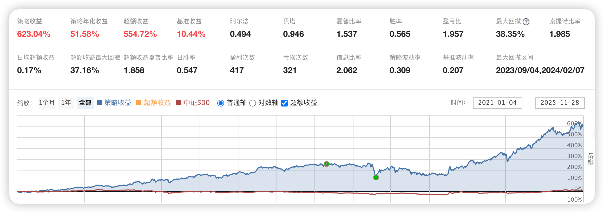

# 117、量化选股与动态调整策略

本策略结合多种量化因子和动态调仓手段，目的是在股市中选择出具有较好增长潜力的股票，并通过定期调整持仓，避免风险，并优化投资组合的表现。策略具体包括以下几个部分。**本文策略的完整代码下载地址请见文末最下方。**

  1. **选股模块** ：通过多因子选股，包括营业收入增长率（SG）、利润增长率（MS）、市盈增长比（PEG）等，筛选出具备良好基本面的股票，并根据不同因子的筛选条件和排序，优化股票池。

  2. **涨停股票管理** ：动态监控和调整持仓中的涨停股票，当涨停股票出现开盘时未涨停的情况，将自动卖出，避免锁仓风险。

  3. **仓位管理** ：根据市场条件和股票池的表现，进行买入和卖出的调仓操作，确保在限制的最大仓位数内，保持一个均衡的投资组合。

  4. **交易成本与风险控制** ：通过设定滑点、交易成本、风险控制等，优化策略的执行效率，并减少因市场波动带来的潜在损失。

  5. **每日持仓信息打印** ：定期输出账户的实时状态和交易记录，便于实时监控策略执行效果，确保投资的透明度。



### 各部分功能代码及说明：

### 1. 初始化函数（initialize）

```python
def initialize(context):
    set_benchmark('000905.XSHG')  # 设置基准指数
    set_option('use_real_price', True)  # 使用真实价格交易
    set_option("avoid_future_data", True)  # 禁用未来数据
    set_option('order_volume_ratio', 1)  # 设置交易量限制
    set_slippage(PriceRelatedSlippage(0.002), type='stock')  # 设置滑点
    set_order_cost(OrderCost(open_tax=0, close_tax=0.001, open_commission=0.0001, close_commission=0.0001, close_today_commission=0, min_commission=0.1), type='fund')  # 设置交易成本
    log.set_level('order', 'error')  # 过滤低于error级别的日志

    g.stock_num = 9  # 持仓最大股票数
    g.limit_up_list = []  # 记录持仓中涨停的股票
    g.hold_list = []  # 当前持仓的股票
    g.history_hold_list = []  # 历史持仓记录
    g.not_buy_again_list = []  # 最近买过且涨停过的股票不再买入
    g.limit_days = 10  # 不再买入的时间段天数
    g.target_list = []  # 待操作的股票池

    run_daily(prepare_stock_list, time='9:05', reference_security='000300.XSHG')  # 每日准备股票池
    run_weekly(weekly_adjustment, weekday=1, time='9:30', reference_security='000300.XSHG')  # 每周调整持仓
    run_daily(check_limit_up, time='14:00', reference_security='000300.XSHG')  # 检查涨停股票
    run_daily(print_position_info, time='15:10', reference_security='000300.XSHG')  # 打印每日持仓信息
```

  * **功能说明** ：

    * 初始化函数负责设置基准、交易选项、滑点、交易成本等基础配置。

    * 每日、每周调仓、监控涨停股票和打印持仓信息的任务调度。

### 2. 选股模块（get_factor_filter_list 和 get_stock_list）

```python
def get_factor_filter_list(context, stock_list, jqfactor, sort, p1, p2):
    yesterday = context.previous_date
    score_list = get_factor_values(stock_list, jqfactor, end_date=yesterday, count=1)[jqfactor].iloc[0].tolist()
    df = pd.DataFrame(columns=['code','score'])
    df['code'] = stock_list
    df['score'] = score_list
    df = df.dropna()
    df.sort_values(by='score', ascending=sort, inplace=True)
    filter_list = list(df.code)[int(p1*len(stock_list)):int(p2*len(stock_list))]
    return filter_list
```

  * **功能说明** ：

    * 该函数利用指定的量化因子对股票进行评分排序，并根据给定的百分比筛选股票。

```python
def get_stock_list(context):
    yesterday = str(context.previous_date)
    initial_list = list(set(get_all_securities().index) & set(get_hot_industry_stock(context)))
    initial_list = filter_new_stock(context, initial_list)  # 过滤新股
    initial_list = filter_kcb_stock(context, initial_list)  # 过滤科创板股票
    initial_list = filter_st_stock(initial_list)  # 过滤ST股
    ...
    final_list = [sg_list, ms_list, peg_list]
    return final_list
```

  * **功能说明** ：

    * get_stock_list函数结合多个因子（如营业收入增长率、利润增长率等）选出符合条件的股票池，并根据行业热度、流通市值等进一步筛选。

### 3. 仓位管理（weekly_adjustment）

```python
def weekly_adjustment(context):
    all_list = get_stock_list(context)
    sg_list = all_list[0][:5]
    ms_list = all_list[1][:5]
    peg_list = all_list[2][:5]
    union_list = list(set(sg_list).union(set(ms_list)).union(set(peg_list)))
    ...
    g.target_list = g.target_list[:min(g.stock_num, len(g.target_list))]  # 截取不超过最大持仓数的股票量

    # 卖出不在目标池中的股票
    for stock in g.hold_list:
        if stock not in g.target_list:
            close_position(position)
    ...
```

  * **功能说明** ：

    * 每周根据股票池更新买入目标，并进行调仓卖出操作。

### 4. 涨停股票管理（check_limit_up）

```python
def check_limit_up(context):
    now_time = context.current_dt
    if g.high_limit_list != []:
        for stock in g.high_limit_list:
            current_data = get_price(stock, end_date=now_time, frequency='1m', fields=['close','high_limit'], skip_paused=False, fq='pre', count=1, panel=False, fill_paused=True)
            if current_data.iloc[0,0] < current_data.iloc[0,1]:
                close_position(position)  # 卖出涨停打开的股票
```

  * **功能说明** ：

    * 检查持仓中的涨停股票，若涨停打开则提前卖出，避免被套。

### 5. 股票过滤模块（filter_paused_stock, filter_st_stock, filter_kcb_stock 等）

```python
def filter_paused_stock(stock_list):
    current_data = get_current_data()
    return [stock for stock in stock_list if not current_data[stock].paused]
```

  * **功能说明** ：

    * 多个过滤函数确保选出的股票在流动性、风险等方面符合投资要求，包括停牌股、ST股、科创板、次新股等的筛选。

### 6. 交易模块（open_position, close_position）

```python
def open_position(security, value):
    order = order_target_value_(security, value)
    if order != None and order.filled > 0:
        return True
    return False

def close_position(position):
    security = position.security
    order = order_target_value_(security, 0)  # 可能会因停牌失败
    if order != None:
        if order.status == OrderStatus.held and order.filled == order.amount:
            return True
    return False
```

  * **功能说明** ：

    * open_position 和 close_position 是自定义的买入和卖出函数，用于根据给定的价值进行开仓和平仓操作。

### 7. 打印每日持仓信息（print_position_info）

```python
def print_position_info(context):
    trades = get_trades()
    for _trade in trades.values():
        print('成交记录：'+str(_trade))
    for position in list(context.portfolio.positions.values()):
        securities = position.security
        cost = position.avg_cost
        price = position.price
        ret = 100 * (price / cost - 1)
        print('代码:{}'.format(securities))
        ...
```

  * **功能说明** ：

    * 每日打印账户持仓情况，包括每个股票的成本价、现价、收益率、持仓股数等信息，帮助用户了解当前投资组合的表现。

### 总结：

该策略是一种基于多因子选股、动态调仓和风险控制的量化投资策略，旨在通过选取具备良好基本面的股票，并定期调整投资组合，以优化收益并控制风险。策略结合了营业收入增长率、利润增长率和市盈增长比等多个量化因子，通过灵活的因子权重和股票池筛选，保证所选股票具有较好的成长潜力。同时，策略还通过动态监控涨停股票、合理控制滑点和交易成本、避免停牌或退市股票等手段有效规避风险。此外，定期的仓位管理和调仓操作确保了投资组合的稳定性和灵活性，使得策略能够在市场波动中保持稳健表现。总体而言，这一策略在提供相对高收益的同时，通过精确的资金分配和风险控制，避免了极端市场条件下的损失，适用于长期稳定的量化投资管理。

**通过网盘分享的文件：量化选股与动态调整策略.zip**

**下载链接:**<https://pan.baidu.com/s/1QKOCbhCGyXfiy1aSHCeoZQ>

**提取码:** 3cjp
