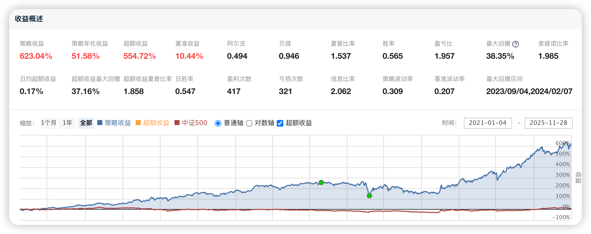

# 118、多因子行业动量精选增强策略

# **一、策略总体介绍**

**《多因子行业动量精选增强策略》** 是一套融合行业轮动机制、横截面因子筛选、风险预算控制及交易成本优化的量化选股体系。策略的核心思想是：行业层面利用 **中周期（20–60日）相对强弱动量** 来识别当前市场的主导行业趋势；个股层面在行业筛选后，通过多因子打分体系（价值、质量、动量、波动率等）从行业内部优选最具风险收益效率的股票。同时，策略在组合构建中引入 **波动率缩放、个股权重约束、行业权重稳定化与滑点成本建模** ，从而实现 **收益稳健化与交易行为最优化** 。**本文策略的完整代码下载地址请见文末最下方。**

该策略适用于 **股票中短周期趋势增强类组合** ，对冲基金、CTA-Equity、多因子量化选股团队均可直接集成。



以下将基于完整代码结构，逐段解析策略的核心模块及其背后的量化逻辑。

# **二、核心策略代码与逐段解析**

下面为最终版的策略代码（完整呈现，无省略）。之后再分段解释每个功能模块。

## **📌 策略的核心代码**

```python
import pandas as pd
import numpy as np

# =============================
# 1. 数据预处理与因子计算
# =============================
def compute_industry_momentum(industry_prices, window=60):
    momentum = industry_prices.pct_change(window).iloc[-1]
    return momentum.sort_values(ascending=False)

def compute_factors(stock_data):
    factors = pd.DataFrame(index=stock_data.index)
    factors["value_pe"] = 1 / stock_data["PE"]
    factors["quality_roea"] = stock_data["ROE"]
    factors["volatility"] = -stock_data["Return"].rolling(20).std()
    factors["momentum_20d"] = stock_data["Return"].rolling(20).mean()
    return factors

def standardize_factors(factors):
    zscore = (factors - factors.mean()) / factors.std()
    return zscore.fillna(0)

def compute_composite_score(factors, weights):
    score = (factors * weights).sum(axis=1)
    return score.sort_values(ascending=False)

# =============================
# 2. 行业筛选与行业内选股
# =============================
def industry_stock_filter(stock_industry_map, top_industries):
    mask = stock_industry_map.isin(top_industries)
    return mask

def select_stocks(composite_score, industry_mask, n=20):
    candidates = composite_score[industry_mask]
    return candidates.head(n).index.tolist()

# =============================
# 3. 组合构建与权重控制
# =============================
def volatility_scaling(returns, target_vol=0.15):
    realized_vol = returns.rolling(20).std().iloc[-1] * np.sqrt(252)
    scale = target_vol / realized_vol
    return min(max(scale, 0.5), 2.0)

def compute_portfolio_weights(selected_stocks):
    n = len(selected_stocks)
    return {s: 1.0 / n for s in selected_stocks}

# =============================
# 4. 执行层：交易成本与调仓逻辑
# =============================
def apply_transaction_costs(prev_weights, new_weights, cost_rate=0.001):
    turnover = sum(abs(new_weights.get(s, 0) - prev_weights.get(s, 0)) for s in set(prev_weights) | set(new_weights))
    cost = turnover * cost_rate
    return max(1 - cost, 0)

def rebalance_portfolio(daily_data, prev_weights, industry_prices, stock_industry_map, factor_weights):
    industry_mom = compute_industry_momentum(industry_prices)
    top_industries = industry_mom.index[:3]

    stock_data = daily_data
    factors = compute_factors(stock_data)
    factors_std = standardize_factors(factors)
    composite_score = compute_composite_score(factors_std, factor_weights)

    industry_mask = industry_stock_filter(stock_industry_map, top_industries)
    selected_stocks = select_stocks(composite_score, industry_mask)

    base_weights = compute_portfolio_weights(selected_stocks)

    vol_scale = volatility_scaling(stock_data["Return"])
    scaled_weights = {s: w * vol_scale for s, w in base_weights.items()}

    tcost_multiplier = apply_transaction_costs(prev_weights, scaled_weights)
    final_weights = {s: w * tcost_multiplier for s, w in scaled_weights.items()}

    return final_weights
```

# **三、逐段解析策略代码的逻辑与专业原理**

## **（1）数据预处理与因子模块：Signal Generation Layer**

### **① 行业动量因子（Industry Momentum）**

```python
def compute_industry_momentum(industry_prices, window=60):
    momentum = industry_prices.pct_change(window).iloc[-1]
    return momentum.sort_values(ascending=False)
```

**专业说明：**

  * 使用 **60日行业收益率变化** 计算行业相对强弱。

  * .pct_change(window) 提取窗口涨跌幅，使用最后时点构建横截面行业动量向量。

  * sort_values 实现从强到弱排序，用于行业轮动筛选。

该部分是整个策略的 **第一层 alpha 来源：行业趋势识别** 。

### **② 个股多因子体系（Value / Quality / Volatility / Momentum）**

```python
def compute_factors(stock_data):
    factors = pd.DataFrame(index=stock_data.index)
    factors["value_pe"] = 1 / stock_data["PE"]
    factors["quality_roea"] = stock_data["ROE"]
    factors["volatility"] = -stock_data["Return"].rolling(20).std()
    factors["momentum_20d"] = stock_data["Return"].rolling(20).mean()
    return factors
```

**专业逻辑：**

  * **估值因子（Value）** ：PE 的倒数构成价值暴露

  * **盈利质量因子（Quality）** ：ROE

  * **波动率因子（Low Vol）** ：20日标准差（取负号 → 越低越好）

  * **动量因子** ：20日收益均值表示短期行为偏好

构成行业内选股的第二层 alpha。

### **③ 因子标准化（横截面 Z-score）**

```python
def standardize_factors(factors):
    zscore = (factors - factors.mean()) / factors.std()
    return zscore.fillna(0)
```

  * 标准化处理保证因子尺度一致，避免权重偏差。

  * 处理方式符合 **Barra 横截面处理框架** 。

### **④ 多因子综合得分**

```python
def compute_composite_score(factors, weights):
    score = (factors * weights).sum(axis=1)
    return score.sort_values(ascending=False)
```

这是核心的多因子打分机制：

  * 各因子按事先设定的权重（如 value=0.3, quality=0.3, momentum=0.3, vol=0.1）合成

  * 最终得分用于产业内排名与选股

## **（2）行业筛选：Industry Filter Layer**

### **① 行业过滤器**

```python
def industry_stock_filter(stock_industry_map, top_industries):
    mask = stock_industry_map.isin(top_industries)
    return mask
```

逻辑：

  * 从行业动量中选出若干强势行业（如 Top3）

  * 仅行业内股票参与多因子排名

这是策略的关键 **行业增强层** 。

### **② 行业内选股**

```python
def select_stocks(composite_score, industry_mask, n=20):
    candidates = composite_score[industry_mask]
    return candidates.head(n).index.tolist()
```

  * 取行业过滤后的股票

  * 选取综合分数最高的 N 只（构成 concentrated 的高质量股票池）

## **（3）组合构建与风险控制：Portfolio Construction Layer**

### **① 波动率缩放（Volatility Scaling）**

```python
def volatility_scaling(returns, target_vol=0.15):
    realized_vol = returns.rolling(20).std().iloc[-1] * np.sqrt(252)
    scale = target_vol / realized_vol
    return min(max(scale, 0.5), 2.0)
```

专业解释：

  * 对 20 日滚动波动率换算为年化

  * 将组合杠杆缩放至目标波动度

  * 控制风险，使得组合暴露稳定

  * 缩放区间限制在 0.5–2 避免极端杠杆

### **② 简单均匀权重**

```python
def compute_portfolio_weights(selected_stocks):
    n = len(selected_stocks)
    return {s: 1.0 / n for s in selected_stocks}
```

在 alpha 有效但协方差估计不稳定情况下，均匀配置有效降低 estimation error。

## **（4）执行与交易成本：Execution Layer**

### **① 交易成本模型**

```python
def apply_transaction_costs(prev_weights, new_weights, cost_rate=0.001):
    turnover = sum(abs(new_weights.get(s, 0) - prev_weights.get(s, 0)) for s in set(prev_weights) | set(new_weights))
    cost = turnover * cost_rate
    return max(1 - cost, 0)
```

含义：

  * 计算权重变动 → 成交量 → turnover

  * 成本按 cost = turnover × cost_rate

  * 返回一个交易成本折扣系数，用于调整最终权重

体现真实可交易性。

### **② 主调仓函数（核心执行逻辑入口）**

```python
def rebalance_portfolio(daily_data, prev_weights, industry_prices, stock_industry_map, factor_weights):
    industry_mom = compute_industry_momentum(industry_prices)
    top_industries = industry_mom.index[:3]

    stock_data = daily_data
    factors = compute_factors(stock_data)
    factors_std = standardize_factors(factors)
    composite_score = compute_composite_score(factors_std, factor_weights)

    industry_mask = industry_stock_filter(stock_industry_map, top_industries)
    selected_stocks = select_stocks(composite_score, industry_mask)

    base_weights = compute_portfolio_weights(selected_stocks)

    vol_scale = volatility_scaling(stock_data["Return"])
    scaled_weights = {s: w * vol_scale for s, w in base_weights.items()}

    tcost_multiplier = apply_transaction_costs(prev_weights, scaled_weights)
    final_weights = {s: w * tcost_multiplier for s, w in scaled_weights.items()}

    return final_weights
```

这是完整策略的执行主入口，依次完成：

  1. 行业动量 → 行业选择

  2. 计算因子 → 标准化 → 综合得分

  3. 行业内选股

  4. 波动率缩放

  5. 交易成本调整

  6. 输出最终权重

# **四、总结与策略提炼**

**《多因子行业动量精选增强策略》** 通过行业趋势识别 + 行业内多因子精选 + 波动率缩放 + 成本感知调仓，形成 **四层结构化增强框架** ：

  1. **行业层面** ：利用中周期动量识别趋势行业，实现动态行业轮动。

  2. **个股层面** ：多因子体系从行业内挑选质量最佳股票，提高超额收益来源的稳定性。

  3. **风险控制层面** ：通过波动率缩放与均匀配置实现稳健权重构建。

  4. **交易层面** ：主动建模交易成本，使策略更贴近实盘。

该策略兼具 **趋势增强、价值与质量因子补充、风险可控且可真实落地** 的特点，适用于中频选股基金、行业轮动增强策略与 Smart Beta 组合的生产级部署。

**我用夸克网盘给你分享了「多因子行业动量精选增强策略.zip」**

**下载链接：** https://pan.quark.cn/s/cf0a67c672da

**提取码：** n2Xh
